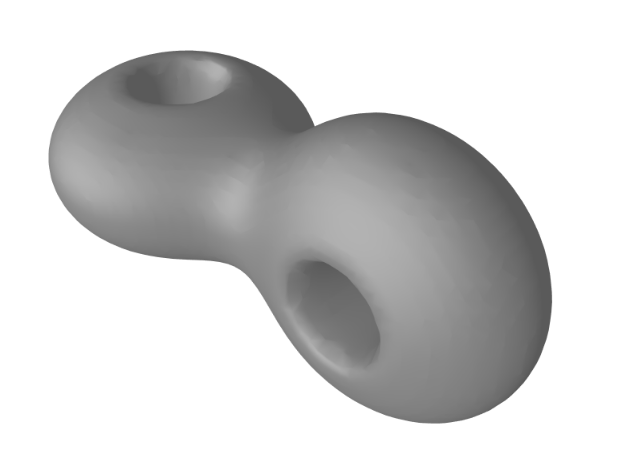
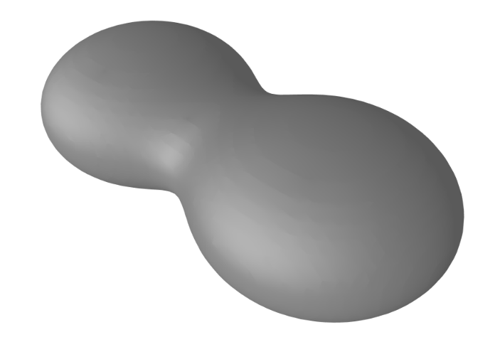
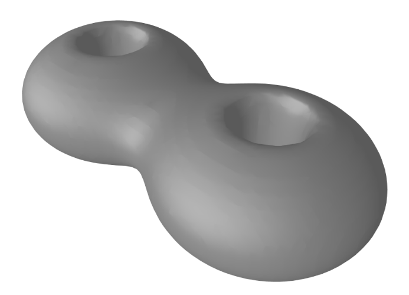

# Geometry Blender



GeoBlend is a library to smoothly blend geometric objects using the following 
operations

- Union
- Intersection
- Subtraction
- Global Deformations

The resulting object is an analytic expression ``f = f(x,y,z)``
(i.e a closed mathematical
formula) such that the resulting geometric object will be defined by 
the inequality 

```python
f(x,y,z) <= 1/2
```

The surface of this object is the level set

```python
f(x,y,z) == 1/2
```

We can mesh this level set using  algorithms like 
[Marching Cubes](https://en.wikipedia.org/wiki/Marching_cubes)
or 
[Marching Tetrahedra](https://en.wikipedia.org/wiki/Marching_tetrahedra), and then render it using a graphing system.

---
### Example: Twisted Double Torus in 3-dimensional space
(*See Jupyter notebook [TwistedDoubleTorus.ipynb](jupyter/TwistedDoubleTorus.ipynb) for the complete code*)

We can create a "twisted double torus" as follows. First, we join two lenticular shaped objects using the code

```python
b1 = Ball3D()
b1.scale(1/2,1/2,1/3)
b1.translate(-1/2,0,0)

b2 = Ball3D()
b2.scale(1/2,1/2,1/3)
b2.translate(1/2,0,0)

obj1 = b1 + b2
```

The ball ``b1`` represent a ball radius `1` centered at the origin.
Then we scale `b1`  by a factor 
``1/2`` along the `x` and `y` plane, and by a factor of `1/3` along the `z` axis; This 
produces a lenticular shaped object which is thinner in the ``z``-direction.
Next, we translate  `b1` by an amount of `1/2` in the `x`-direction. The object `b2` 
is constructed in a similar way, but is translated by an amount of `-1/2` in the `x`-direction.
Finally, we construct `obj1` as the blended sum (union) of `b1` and `b2`.




We now make two holes to the above object by subtracting two cylinders `c1`
and `c2` to `obj1`

```python
c1 = Cylinder3D()
c1.scale(1/8,1/8,1)
c1.translate(-1/2,0,0)

c2 = Cylinder3D()
c2.scale(1/8,1/8,1)
c2.translate(1/2,0,0)

obj2 = obj1-(c1+c2)
```



Finally, we twist one of the holes as follows

```python 
theta = pi/2
b2r = b2.rotated(1,0,0,theta)
c2r = c2.rotated(1,0,0,theta)
obj3 = (b1+b2r)-(c1+c2r)
```

The above code produces `b2r` and `c2r` by rotating ``b2`` and ``c2`` an angle of ``pi/2``;
using the vector ``(1,0,0)`` as the axis of rotation. The object `obj3` is shown in
the figure below. 


---
## Requirements 

- Numpy - For the main library
- Sympy - For the main library
- Scikit-image - For plotting implicit surfaces. Installation:
    - Anaconda Python: *conda install scikit-image*
    - Pip: *pip install scikit-image*

---
## Installation

Download the folder and open the Jupyter notebooks.

---
